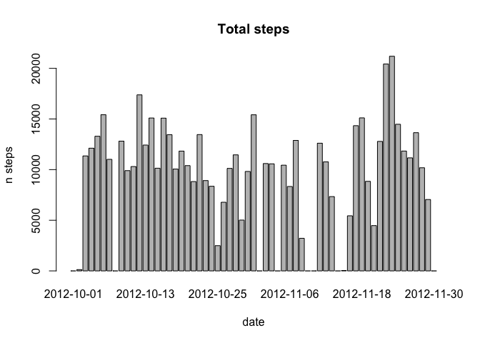
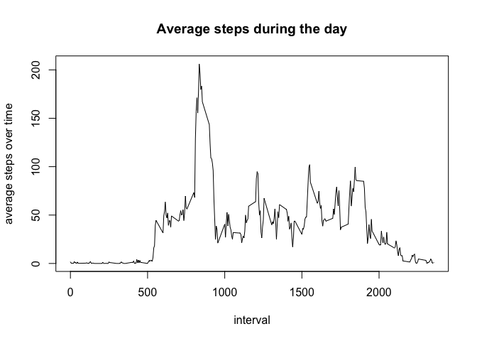
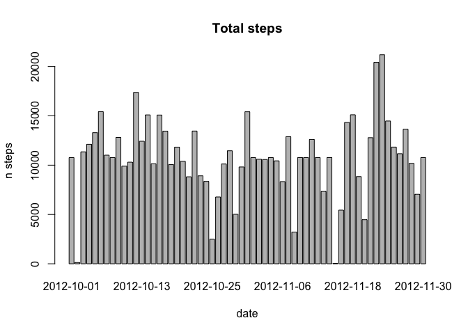
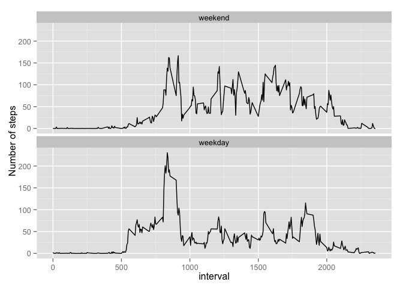

# Reproducible Research: Peer Assessment 1


## Loading and preprocessing the data

```r
# 1.load data
rdata <- read.csv("activity.csv")  
# 2.process/transmform...hum no
rdata$date <- as.Date(rdata$date)
rdata$steps <- as.numeric(rdata$steps)
rdata$interval <- as.numeric(rdata$interval)
```

## What is mean total number of steps taken per day?

```r
# get a list of each date
dates <- levels(factor(rdata$date))
# 1.calculate and 2.barchart the number of steps taken per day
tsteps <- sapply(dates, function(x) sum(rdata[rdata$date==x,"steps"], na.rm=TRUE))
barplot(tsteps, main="Total steps", xlab="date", ylab="n steps")
```

 

```r
# 3. mean? median?
start_mean <- mean(tsteps)
start_median <- median(tsteps)
```
For this first section, simply ignoring NA values, the mean total number of steps taken per day is 9354.23 and the median is 10395.

## What is the average daily activity pattern?

```r
# 1. time series of average number of steps taken
intervals <- levels(factor(rdata$interval))
steps_ave <- aggregate(steps~interval, data=rdata, FUN=mean, na.action=na.omit)
plot(steps_ave, main="Average steps during the day", xlab="interval", ylab="average steps over time", type = 'l')
```

 

```r
# 2. when was the maximum?
maxatindex <- which(steps_ave$steps == max(steps_ave$steps, na.rm = TRUE))
sample_max <- steps_ave[maxatindex,]
```

The most active interval of the day overall is 835 with an average number of steps of 206.1698.

## Imputing missing values

```r
# 1. number of missing values
sum(is.na(rdata$steps))
```

```
## [1] 2304
```

```r
# 2. filling in all of the missing values in the dataset with the average of the corresponding interval
d <- rdata
for(i in 1:length(d$steps))
{
  d$steps[i] <- if(!is.na(d$steps[i])) d$steps[i] else
    {steps_ave$steps[which(steps_ave$interval == d$interval[i])]}
}
# 4. histogram? mean? median?
new_tsteps <- sapply(dates, function(x) sum(d[d$date==x,"steps"]))
barplot(new_tsteps, main="Total steps", xlab="date", ylab="n steps")
```

 

```r
new_mean <- mean(new_tsteps)
new_median <- median(new_tsteps)
```

For this modified dataset section, changing NA with avearage for the corresponding interval, the new values for mean total number of steps taken per day is 10766.19 and the median is 10766.19.


```
##           mean   median
## start  9354.23 10395.00
## new   10766.19 10766.19
```

New values are different then start values for mean and median. The median is relatively close but mean has increased, indeed, because more data has been added when replacing all missing entries.

## Are there differences in activity patterns between weekdays and weekends?

```r
# 1. Create new factor weekday and weekend
d$weekend <- chron::is.weekend(d$date)
d$weekend <- factor(d$weekend, levels=c(TRUE,FALSE), labels=c('weekend','weekday'))
dday <- aggregate(steps~interval+weekend, data=d, FUN=mean)
# 2. panel plot containing time series plot of interval
library(ggplot2)
ggplot(data=dday, aes(x=interval, y=steps)) +
  geom_line() + ylab("Number of steps") +
  facet_wrap(~weekend, nrow=2)
```

 

Yes, there are differences in activity patterns between weekdays and weekends.
The person starts slower during weekend probably because he sleeps more, also he is generally more active for the rest of the day and finally stops a little bit later.
